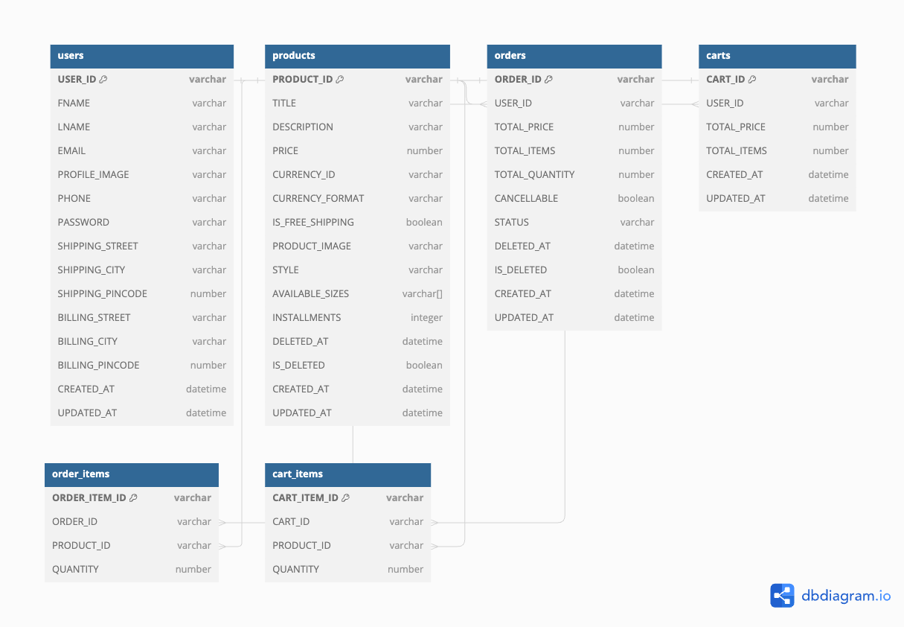

# # Ecommerce-Website

## Description
Developed a comprehensive e-commerce site with a focus on user management, product catalogue, cart functionality, and order processing. Designed and implemented robust backend models and APIs for managing users, products, carts, and orders. Utilized JWT tokens for secure authorization

## Database Schema Diagram

Below is the database schema diagram for our project. This diagram provides an overview of the database structure, including tables, relationships, and key constraints.

# Ecommerce-Site Application - Feature Implementation Outline

This outline provides a clear and structured approach for implementing the four main features of the Ecommerce-Site application: User, Product, Cart, and Order. Each feature includes specific models and associated APIs to handle operations such as creating users, products, carts, and orders, as well as updating and retrieving relevant information.

## Feature I - User

### Models

- **User Model**: The user model defines the structure for storing user information, including personal details, address, and authentication credentials. It includes validation rules and constraints, such as mandatory fields, unique email and phone numbers, and password encryption.

### APIs

- **POST /register**: Allows users to register by providing necessary details and uploading a profile image. The password is encrypted using bcrypt.
- **POST /login**: Authenticates users using their email and password, and returns a JWT token along with the user ID upon successful login.
- **GET /user/{userId}/profile**: Retrieves the profile details of a logged-in user, ensuring that the `userId` in the URL matches the one in the token.
- **PUT /user/{userId}/profile**: Allows users to update their profile details, with authentication and authorization checks.

## Feature II - Product

### Models

- **Product Model**: Defines the structure for storing product information, including title, description, price, currency, and available sizes. It also handles product image storage via S3 and includes fields for tracking deletion status.

### APIs

- **POST /products**: Allows the creation of a new product, including image upload to S3.
- **GET /products**: Retrieves a list of products with optional filters for size, name, and price range. Sorting by price is also supported.
- **GET /products/{productId}**: Retrieves details of a specific product by its ID.
- **PUT /products/{productId}**: Updates product information based on the provided product ID.
- **DELETE /products/{productId}**: Marks a product as deleted.

## Feature III - Cart

### Models

- **Cart Model**: Represents a shopping cart, including the user, items (with quantity), total price, and total items.

### APIs

- **POST /users/{userId}/cart**: Adds products to a user's cart, creating the cart if it doesn't already exist. Validates the products and ensures the user exists.
- **PUT /users/{userId}/cart**: Updates the cart by removing or reducing the quantity of products.
- **GET /users/{userId}/cart**: Retrieves the cart summary for the user.
- **DELETE /users/{userId}/cart**: Deletes the user's cart, effectively emptying it.

## Feature IV - Order

### Models

- **Order Model**: Defines the structure for an order, including user ID, items, total price, total items, total quantity, and order status. It also includes fields for tracking deletions and cancellations.

### APIs

- **POST /users/{userId}/orders**: Creates an order for a user, using the details from the cart.
- **PUT /users/{userId}/orders**: Updates the status of an order, with validation for cancellation eligibility.
